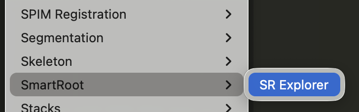
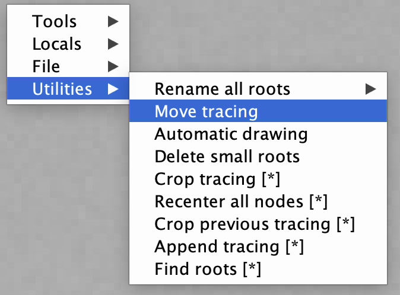
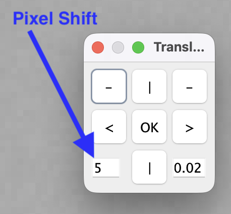
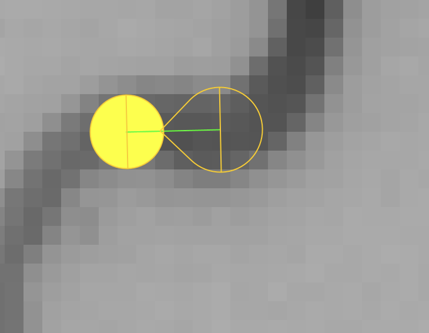
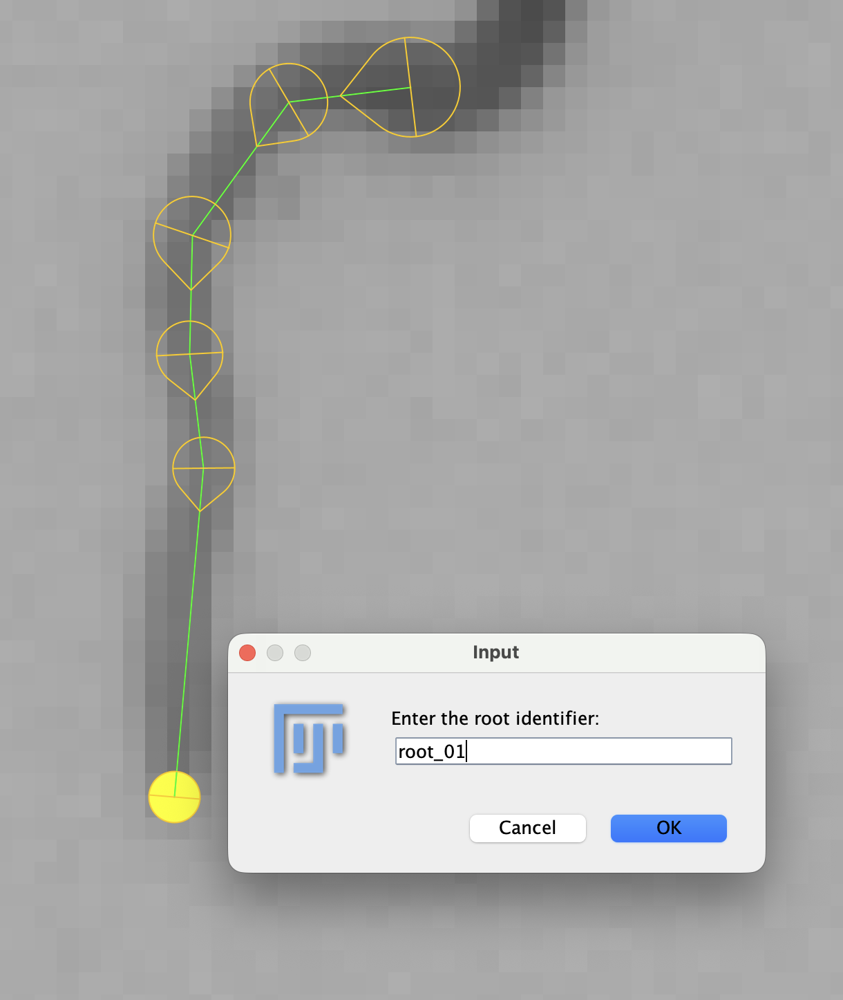
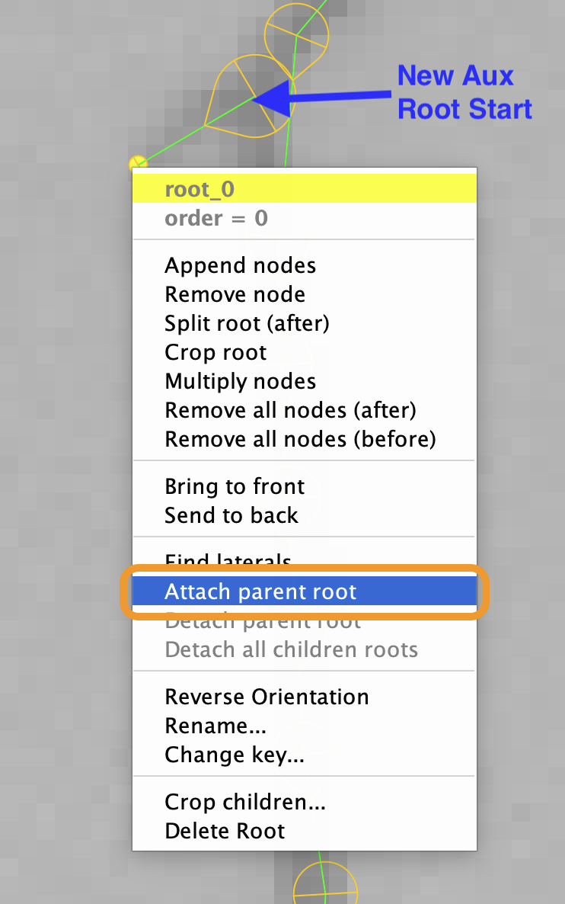
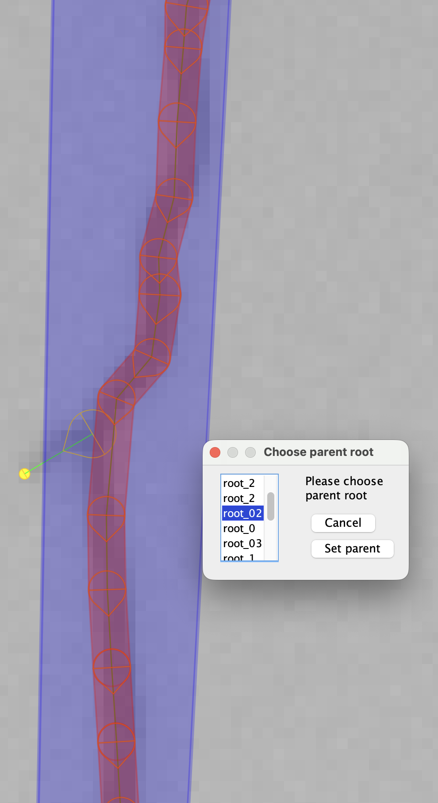

# SmartRoot Installation and User Guide

Smart root allows time-series annotation of root image data with a minimum of redundant work.

## Installation

[SmartRoot Home Page](https://smartroot.github.io/)

1. Install [Fiji](https://fiji.sc/) - See [Block 2B, Task 1 for Specific Instructions](https://adsai.buas.nl/Year2/BlockB/DataLab%20Tasks.html#task-1-image-annotation-and-review)
2. Download and unpack the [SmartRoot Plugin Files](https://github.com/SmartRoot/SmartRoot-Installation/raw/master/SmartRoot.zip)
3. Make sure Fiji is not running and move the `Downloads/SmartRoot/SmartRoot` folder into `Fiji/plugins` (drag and drop the entire folder)
4. Confirm installation: Start Fiji and click on `Plugins > SmartRoot > SR Explorer`
    - 

## Annotating Time Series Data

SmartRoot allows you to annotate root structures using a point and click system. It smartly "snaps" new root nodes to the root structure making it easier to annotate roots. When annotating the current image at time step t, the annotations from t-1 can be loaded to reduce redundant annotation.

### Loading Previous Annotations

You must have at least one time-step that has roots annotated to use this feature. If this is the first frame with a root annotation, skip these steps and go on to [Primary Root Annotation](#primary-root-annotation). 

1. Launch the SR Explorer
2. Open the next un-annotated frame in the series. For example: 28_07_05.png
3. Right click anywhere on the frame and choose: `File > Import previous data fle`
4. When asked about "Tracing Scale", choose the default: 1.0.
5. Locate the previous RSML file and choose `Select Seed Datafile`. In this example: 28_07_04.rsml
6. When asked `Is the tracing OK?`, zoom in and see if the majority of the root tracing aligns with the roots. If it does, choose `Yes`, if not choose `No` and see "Correcting Misplaced Tracing" steps below.

**Correcting Misplaced Tracing**

1. Right click on the image and choose `Utilities > Move Tracing`
    - 
2. Use the arrows to shift and rotate the tracing. Adjust the number of pixels to shift by adjusting the lower left hand value.
    - 
3. Click OK when done

### Primary Root Annotation

The next step is to trace the primary roots. Follow these guidelines:

- The left most root is root_01
- The right most root is root_05
- There should ALWAYS be 5 roots, even if a seed fails to germinate
- Only annotate from the shoot to the root tip
- Follow the center line as closely as possible

1. Zoom out and click on the Root Trace Tool
    - [Primary Root Tool](./assets/smartroot/sr_trace_root_tool.png)
2. Hover the mouse over the first root and use `=` to zoom in on the root/shoot interface
3. Click once to add a root marker. The tool will attempt to "snap" to the middle line of the root.
    - 
4. Hold down the ALT key on the keyboard to activate the "auto follow" feature and click on the midline of the root near to the first point to continue annotating. Smart Root will attempt to follow the root. It may stop part way through the root. In this case simply hold down ALT and click again slightly beyond the last point.
   - Mac users: Hold down the OPTION key.
   - Add additional points as needed manually by releasing the ALT key
   - Hold down the CTRL key to turn off the snapping feature
5. When you reach the root tip **DO NOT LEFT CLICK ON THE ROOT TIP**. Instead **RIGHT CLICK** to bring up the naming/saving menu. See the naming convention above.
    - 
6. Unneeded nodes can be removed by right clicking and choosing `Remove Node`
7. Repeat for all rots. Your work is saved as you go in a `.rsml` file.
8. Close the image to finish annotation

**Handling Unwanted Roots**

If you accidentally start a new root that is unwanted, simply right click and press `ESC` to cancel. 

If you want to remove a root entirely, Right click on an existing node and choose `Delete Root`

### Auxiliary Root Annotation

After annotating the primary root, add any auxiliary roots.

1. Using the same tool and procedure as above, click on the auxiliary root near the primary root to create a new start.
2. Follow the root using the same process as above.
3. When the tip is reached, right click using the same process as above to finish; give the root any name (e.g. root_0)
4. Right click on the new root and choose "Attach Parent Root"
    - 
5. The current root you are annotating should automatically be chosen and highlighted as shown below. If it is not highlighted, choose it from the list, or quit by pressing ESC and right clicking once on the correct parent root and then repeat step 4. The nodes will turn green to indicate that the root is an Aux root.
    - 
6. Repeat steps 1-5 for all new laterals.
7. Annotate any new growth using the same primary root methods.