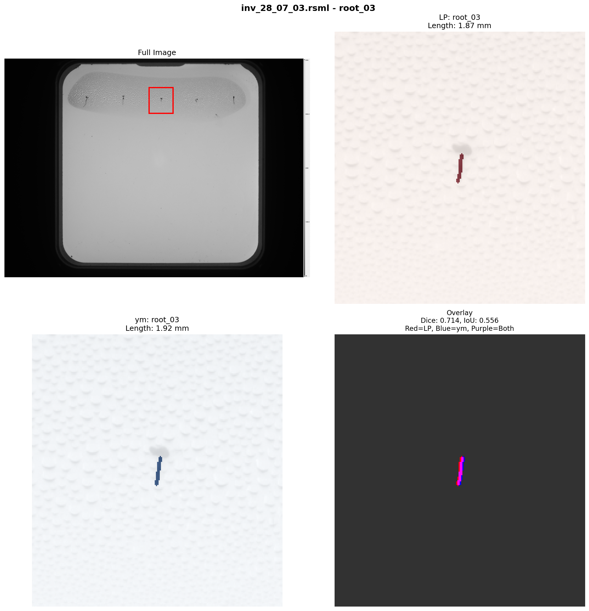

# Annotation Quality Report

## Dataset Overview

- **Total annotations**: 513
- **Annotators**: LP, ac, ym
- **Files annotated**: 15

### Files per Annotator

- **LP**: 7 files
- **ac**: 14 files
- **ym**: 15 files

- **Primary roots** (root_01 to root_05): 178
- **Auxiliary/lateral roots**: 335

## Validation Issues

**Files missing primary roots**: 1

- **ac**: `inv_28_07_02.rsml`
  - Missing: ['root_03', 'root_04']
  - Present: ['root_01', 'root_02', 'root_05']

## Inter-Annotator Agreement

**Total pairwise comparisons**: 136

### Intraclass Correlation Coefficient (ICC)

**Model**: ICC(2,1) - Two-way random effects, absolute agreement

| Metric | Value |
|--------|-------|
| ICC | 0.998 |
| 95% CI | [0.997, 0.999] |
| Interpretation | Excellent reliability |
| Items (measurements) | 33 |
| Raters (annotators) | 3 |

**Guidelines** (Koo & Li, 2016):
- < 0.50: Poor reliability
- 0.50-0.75: Moderate reliability
- 0.75-0.90: Good reliability
- > 0.90: Excellent reliability

### Length Measurements

| Metric | Value |
|--------|-------|
| Mean absolute difference | 0.367 mm |
| Median absolute difference | 0.287 mm |
| Std deviation | 0.325 mm |
| Max difference | 1.424 mm |
| Min difference | 0.003 mm |

### SMAPE (Kaggle Competition Metric)

| Metric | Value |
|--------|-------|
| Mean SMAPE | 5.267 |
| Median SMAPE | 1.509 |
| Std SMAPE | 11.478 |

*Reference: Kaggle baseline SMAPE was 8.285*

### Spatial Overlap (Masks)

| Metric | Value |
|--------|-------|
| Mean Dice coefficient | 0.803 |
| Median Dice coefficient | 0.821 |
| Mean IoU | 0.678 |
| Median IoU | 0.696 |

### By Annotator Pair

#### LP vs ac

- **Comparisons**: 33
- **Length difference**: 0.265 +/- 0.236 mm
- **SMAPE**: 4.063 +/- 5.678
- **Dice coefficient**: 0.810 +/- 0.036
- **IoU**: 0.682 +/- 0.050

#### LP vs ym

- **Comparisons**: 35
- **Length difference**: 0.446 +/- 0.414 mm
- **SMAPE**: 8.891 +/- 18.327
- **Dice coefficient**: 0.772 +/- 0.168
- **IoU**: 0.649 +/- 0.155

#### ac vs ym

- **Comparisons**: 68
- **Length difference**: 0.376 +/- 0.302 mm
- **SMAPE**: 3.986 +/- 8.388
- **Dice coefficient**: 0.816 +/- 0.040
- **IoU**: 0.691 +/- 0.055

## Cases Requiring Review

The following cases show the worst spatial disagreements (lowest Dice coefficients).

### Problem Case 1

**File**: `inv_28_07_02.rsml` | **Root**: root_04 | **Annotators**: LP vs ym

| Metric | Value |
|--------|-------|
| LP length | 0.41 mm |
| ym length | 0.37 mm |
| Length difference | 0.042 mm (11.4%) |
| Dice coefficient | 0.000 |
| IoU | 0.000 |
| SMAPE | 10.823 |

### Problem Case 2

**File**: `inv_28_07_02.rsml` | **Root**: root_03 | **Annotators**: LP vs ym

| Metric | Value |
|--------|-------|
| LP length | 0.37 mm |
| ym length | 0.12 mm |
| Length difference | 0.250 mm (216.4%) |
| Dice coefficient | 0.276 |
| IoU | 0.160 |
| SMAPE | 103.944 |

### Problem Case 3

**File**: `inv_28_07_02.rsml` | **Root**: root_02 | **Annotators**: LP vs ym

| Metric | Value |
|--------|-------|
| LP length | 0.73 mm |
| ym length | 1.10 mm |
| Length difference | 0.366 mm (-33.3%) |
| Dice coefficient | 0.638 |
| IoU | 0.468 |
| SMAPE | 39.978 |

### Problem Case 4

**File**: `inv_28_07_03.rsml` | **Root**: root_03 | **Annotators**: ac vs ym

| Metric | Value |
|--------|-------|
| ac length | 1.74 mm |
| ym length | 1.92 mm |
| Length difference | 0.178 mm (-9.3%) |
| Dice coefficient | 0.711 |
| IoU | 0.552 |
| SMAPE | 9.740 |

### Problem Case 5

**File**: `inv_28_07_03.rsml` | **Root**: root_03 | **Annotators**: LP vs ym

| Metric | Value |
|--------|-------|
| LP length | 1.87 mm |
| ym length | 1.92 mm |
| Length difference | 0.051 mm (-2.7%) |
| Dice coefficient | 0.714 |
| IoU | 0.556 |
| SMAPE | 2.711 |

