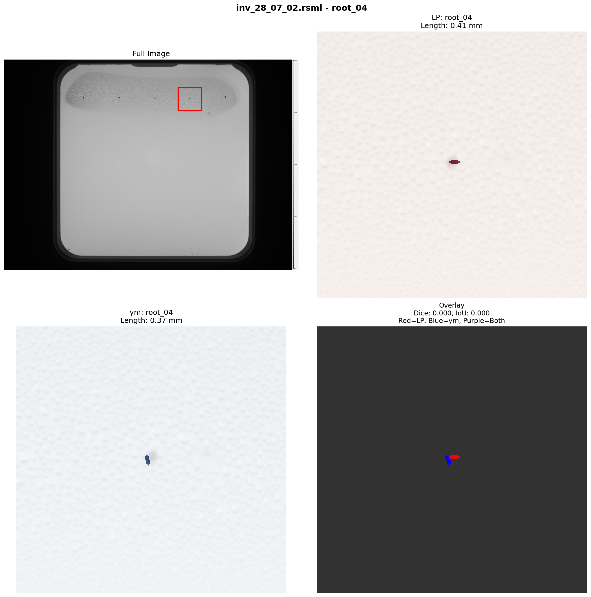
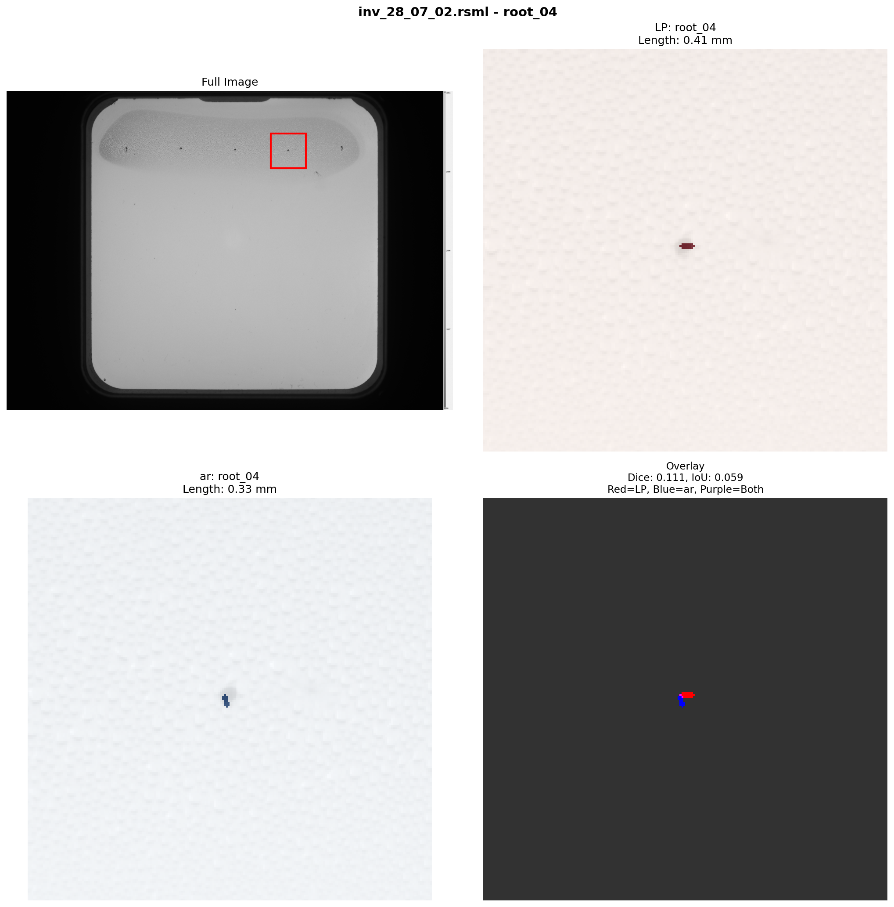
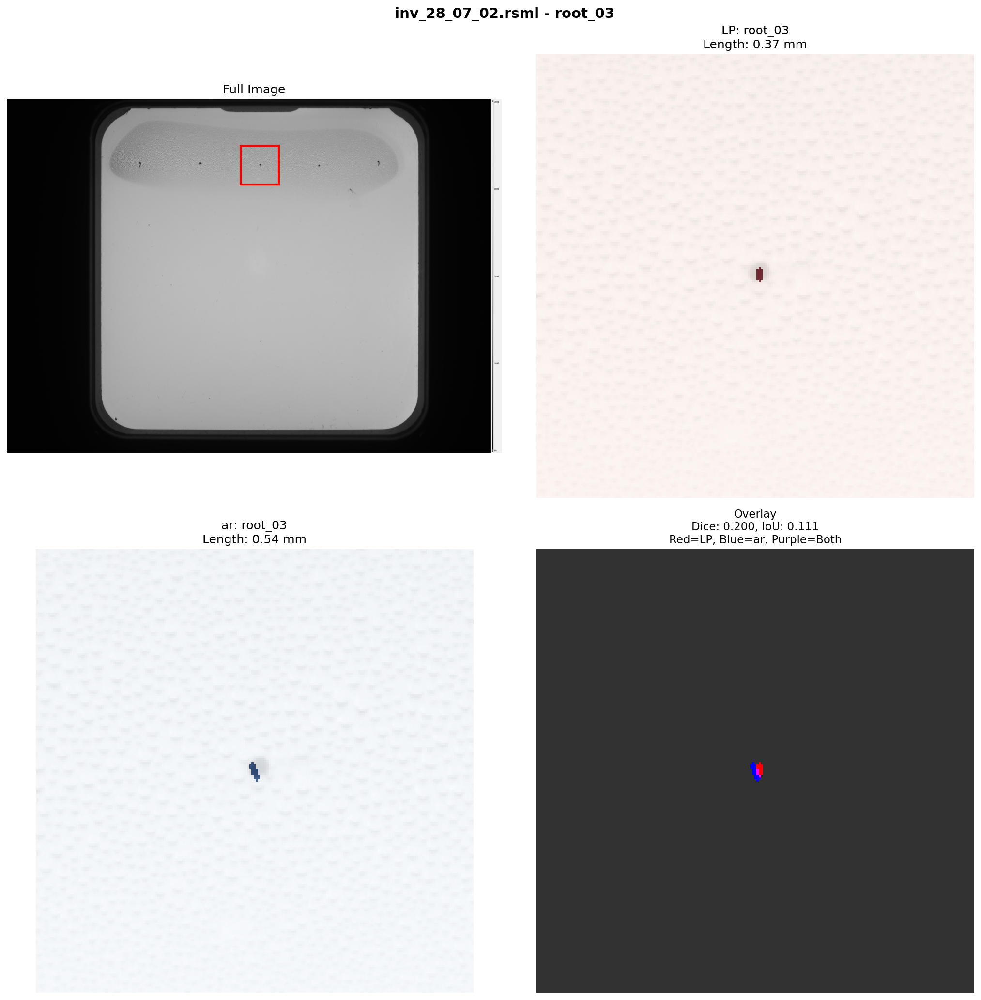
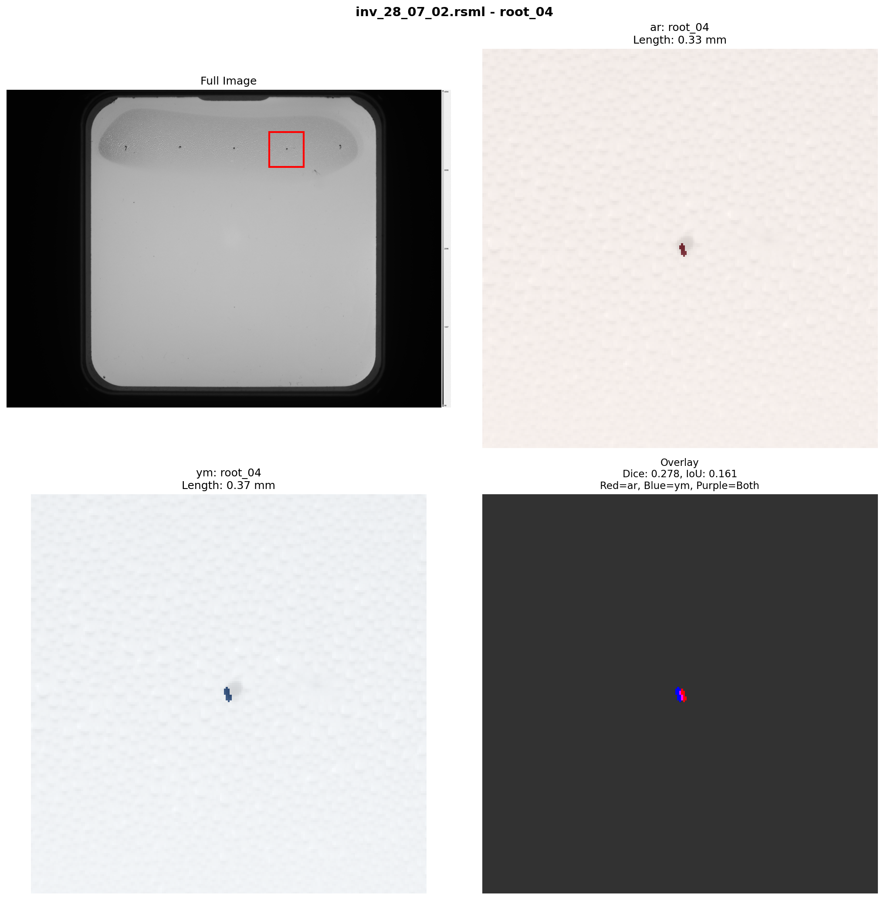

# Annotation Quality Report

## Dataset Overview

- **Total annotations**: 748
- **Annotators**: LP, ac, ar, ym
- **Files annotated**: 15

### Files per Annotator

- **LP**: 7 files
- **ac**: 14 files
- **ar**: 15 files
- **ym**: 15 files

- **Primary roots** (root_01 to root_05): 253
- **Auxiliary/lateral roots**: 495

## Validation Issues

**Files missing primary roots**: 1

- **ac**: `inv_28_07_02.rsml`
  - Missing: ['root_03', 'root_04']
  - Present: ['root_01', 'root_02', 'root_05']

## Inter-Annotator Agreement

**Total pairwise comparisons**: 314

### Intraclass Correlation Coefficient (ICC)

**Model**: ICC(2,1) - Two-way random effects, absolute agreement

| Metric | Value |
|--------|-------|
| ICC | 0.996 |
| 95% CI | [0.995, 0.998] |
| Interpretation | Excellent reliability |
| Items (measurements) | 33 |
| Raters (annotators) | 4 |

**Guidelines** (Koo & Li, 2016):
- < 0.50: Poor reliability
- 0.50-0.75: Moderate reliability
- 0.75-0.90: Good reliability
- > 0.90: Excellent reliability

### Length Measurements

| Metric | Value |
|--------|-------|
| Mean absolute difference | 0.528 mm |
| Median absolute difference | 0.373 mm |
| Std deviation | 0.474 mm |
| Max difference | 2.099 mm |
| Min difference | 0.001 mm |

### SMAPE (Kaggle Competition Metric)

| Metric | Value |
|--------|-------|
| Mean SMAPE | 6.839 |
| Median SMAPE | 2.241 |
| Std SMAPE | 15.860 |

*Reference: Kaggle baseline SMAPE was 8.285*

### Spatial Overlap (Masks)

| Metric | Value |
|--------|-------|
| Mean Dice coefficient | 0.801 |
| Median Dice coefficient | 0.824 |
| Mean IoU | 0.677 |
| Median IoU | 0.700 |

### By Annotator Pair

#### LP vs ac

- **Comparisons**: 33
- **Length difference**: 0.265 +/- 0.236 mm
- **SMAPE**: 4.063 +/- 5.678
- **Dice coefficient**: 0.810 +/- 0.036
- **IoU**: 0.682 +/- 0.050

#### LP vs ar

- **Comparisons**: 35
- **Length difference**: 0.733 +/- 0.617 mm
- **SMAPE**: 8.570 +/- 8.138
- **Dice coefficient**: 0.773 +/- 0.160
- **IoU**: 0.649 +/- 0.152

#### LP vs ym

- **Comparisons**: 35
- **Length difference**: 0.446 +/- 0.414 mm
- **SMAPE**: 8.891 +/- 18.327
- **Dice coefficient**: 0.772 +/- 0.168
- **IoU**: 0.649 +/- 0.155

#### ac vs ar

- **Comparisons**: 68
- **Length difference**: 0.707 +/- 0.580 mm
- **SMAPE**: 4.954 +/- 6.639
- **Dice coefficient**: 0.804 +/- 0.051
- **IoU**: 0.675 +/- 0.069

#### ac vs ym

- **Comparisons**: 68
- **Length difference**: 0.376 +/- 0.302 mm
- **SMAPE**: 3.986 +/- 8.388
- **Dice coefficient**: 0.816 +/- 0.040
- **IoU**: 0.691 +/- 0.055

#### ar vs ym

- **Comparisons**: 75
- **Length difference**: 0.562 +/- 0.423 mm
- **SMAPE**: 10.593 +/- 27.014
- **Dice coefficient**: 0.808 +/- 0.119
- **IoU**: 0.692 +/- 0.134

## Cases Requiring Review

The following cases show the worst spatial disagreements (lowest Dice coefficients).

### Problem Case 1

**File**: `inv_28_07_02.rsml` | **Root**: root_04 | **Annotators**: LP vs ym

| Metric | Value |
|--------|-------|
| LP length | 0.41 mm |
| ym length | 0.37 mm |
| Length difference | 0.042 mm (11.4%) |
| Dice coefficient | 0.000 |
| IoU | 0.000 |
| SMAPE | 10.823 |

### Problem Case 2

**File**: `inv_28_07_02.rsml` | **Root**: root_04 | **Annotators**: LP vs ar

| Metric | Value |
|--------|-------|
| LP length | 0.41 mm |
| ar length | 0.33 mm |
| Length difference | 0.086 mm (26.4%) |
| Dice coefficient | 0.111 |
| IoU | 0.059 |
| SMAPE | 23.332 |

### Problem Case 3

**File**: `inv_28_07_02.rsml` | **Root**: root_03 | **Annotators**: LP vs ar

| Metric | Value |
|--------|-------|
| LP length | 0.37 mm |
| ar length | 0.54 mm |
| Length difference | 0.171 mm (-31.9%) |
| Dice coefficient | 0.200 |
| IoU | 0.111 |
| SMAPE | 37.990 |

### Problem Case 4

**File**: `inv_28_07_02.rsml` | **Root**: root_03 | **Annotators**: LP vs ym

| Metric | Value |
|--------|-------|
| LP length | 0.37 mm |
| ym length | 0.12 mm |
| Length difference | 0.250 mm (216.4%) |
| Dice coefficient | 0.276 |
| IoU | 0.160 |
| SMAPE | 103.944 |

### Problem Case 5

**File**: `inv_28_07_02.rsml` | **Root**: root_04 | **Annotators**: ar vs ym

| Metric | Value |
|--------|-------|
| ar length | 0.33 mm |
| ym length | 0.37 mm |
| Length difference | 0.044 mm (-11.8%) |
| Dice coefficient | 0.278 |
| IoU | 0.161 |
| SMAPE | 12.589 |

