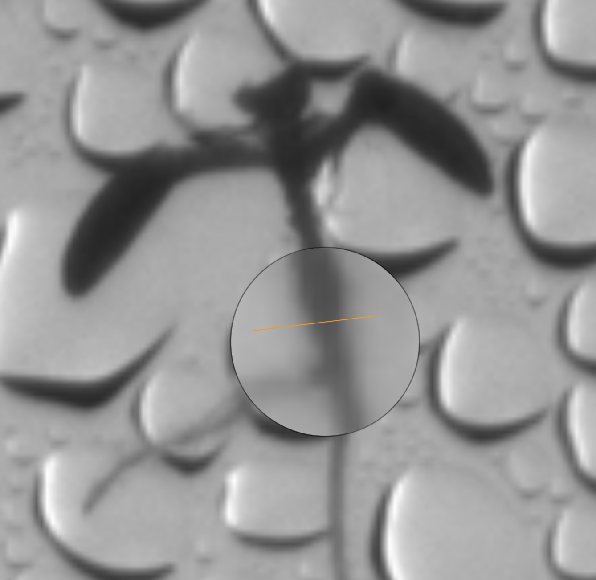
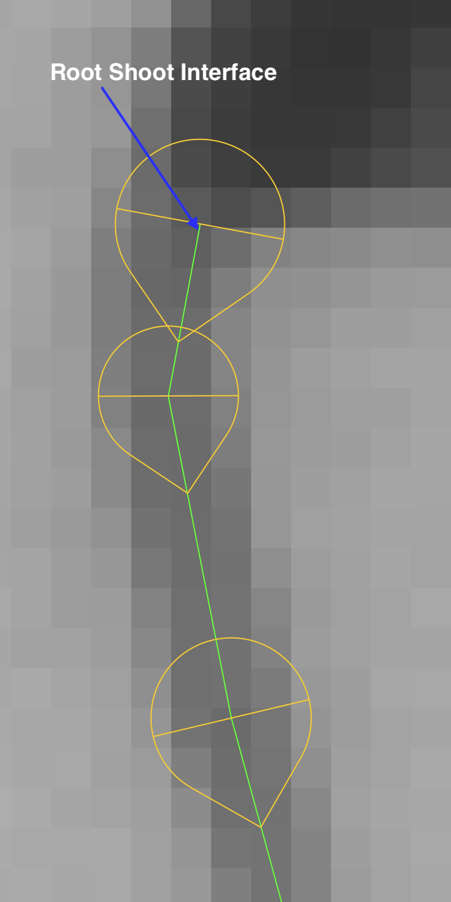
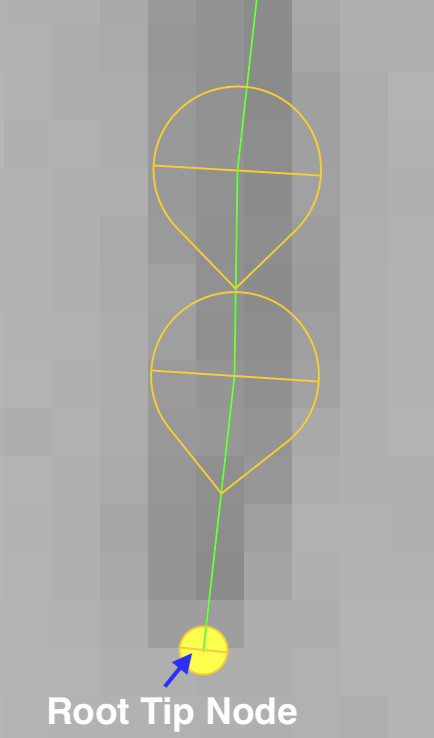

# NPEC Image Annotation Guide

Guide for annotating time-series data provided by NPEC using the Fiji Smart Root Plugin.

## Definitions

**Primary Root:** Main, primarily vertical root for *A. Thaliana*.

**Lateral Root:** Smaller roots emerging from main root.

**Root/Shoot interface:** Location where root obviously changes stem/shoot to root. This interface is defined by the location along the stem where the density decreases and the diameter decreases. 

**Top Node:** First Smart Root node in a RSML series that defines the upper most node. This node should be place such that the line in the node crosses the interface between the root and the shoot interface.

**Root Tip Node:** Final Smart Rood node in an RSML series that defines the bottom most node. This node should be placed such that the line in the node cross the last pixels in the root.

## Guidelines

- Name roots following this pattern: `root_01` .. `root_05` starting from left to right. 
  - Use the `_0N` convention. This prevents name collisions with the default Smart Root naming feature
  - There should always be 5 roots, even if a seed fails to germinate
  - If a seed is missing or fails to germinate count the position and use the next logical index. For example, if seed 2 of 5 fails to germinate, the existing entities should be labeled `root_01`, `root_03`, `root_04` and `root_05`
- Place the nodes as close to the center line of the root as possible
- Avoid moving/adjusting existing nodes if possible. Instead, try to realign using the `Move Tracing` feature
- Adjust nodes in time-series data to reflect any root movement that may have occurred, especially with young roots
- Check top nodes to ensure that they accurately align with the root/shoot interface
  - Delete any nodes that do not accurately represent
- Use the ALT+Click method or `Append node` methods for extending existing roots
- Add lateral roots such that the first node overlaps with the primary root
- Attach lateral roots as to `parent roots` 
  - Always verify visually that the correct parent root is chosen.
  - Try to connect lateral roots to the main root whenever possible even if the connection is occluded and cannot be precisely joined.
